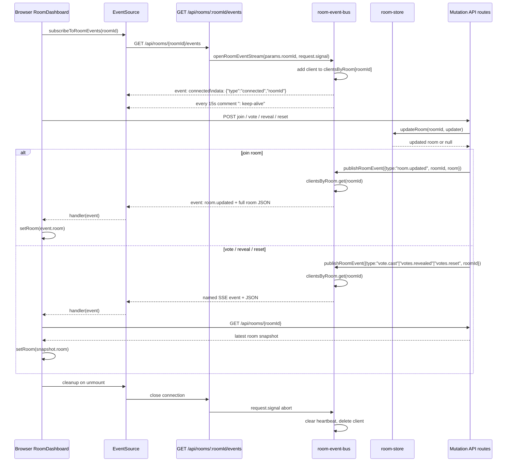

```mermaid
sequenceDiagram
  participant C as Browser RoomDashboard
  participant ES as EventSource
  participant ER as GET /api/rooms/:roomId/events
  participant Bus as room-event-bus
  participant Store as room-store
  participant Mut as Mutation API routes

  C->>ES: subscribeToRoomEvents(roomId)
  ES->>ER: GET /api/rooms/{roomId}/events
  ER->>Bus: openRoomEventStream(params.roomId, request.signal)
  Bus->>Bus: add client to clientsByRoom[roomId]
  Bus-->>ES: event: connected\ndata: {"type":"connected","roomId"}
  Bus-->>ES: every 15s comment ": keep-alive"

  C->>Mut: POST join / vote / reveal / reset
  Mut->>Store: updateRoom(roomId, updater)
  Store-->>Mut: updated room or null

  alt join room
    Mut->>Bus: publishRoomEvent({type:"room.updated", roomId, room})
    Bus->>Bus: clientsByRoom.get(roomId)
    Bus-->>ES: event: room.updated + full room JSON
    ES-->>C: handler(event)
    C->>C: setRoom(event.room)
  else vote / reveal / reset
    Mut->>Bus: publishRoomEvent({type:"vote.cast"|"votes.revealed"|"votes.reset", roomId})
    Bus->>Bus: clientsByRoom.get(roomId)
    Bus-->>ES: named SSE event + JSON
    ES-->>C: handler(event)
    C->>Mut: GET /api/rooms/{roomId}
    Mut-->>C: latest room snapshot
    C->>C: setRoom(snapshot.room)
  end

  C->>ES: cleanup on unmount
  ES->>ER: close connection
  ER->>Bus: request.signal abort
  Bus->>Bus: clear heartbeat, delete client
```